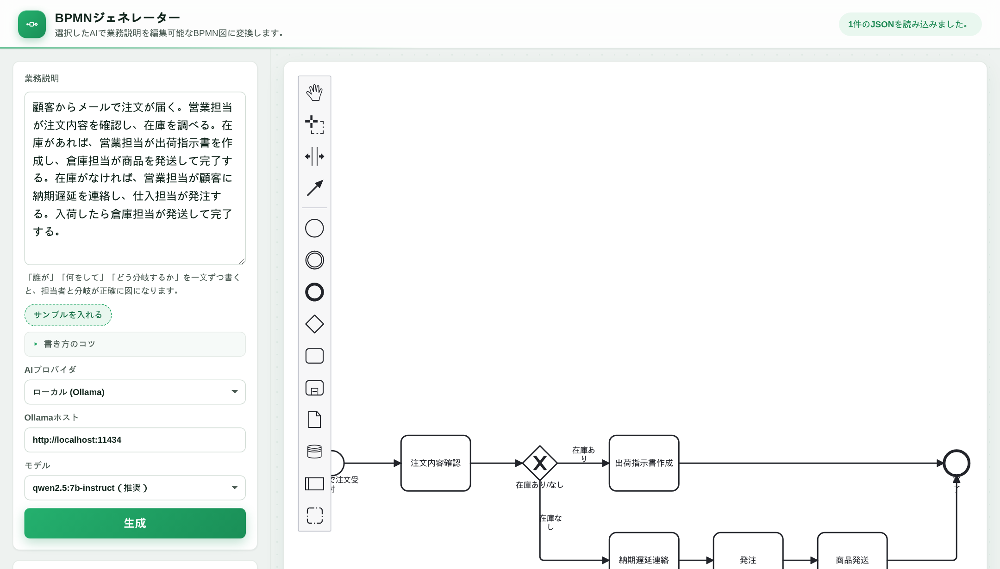

# BPMNジェネレーター

**日本語で業務を説明すると、編集できる業務フロー図（BPMN）に変換するWebアプリです。**
AIの処理は**あなたのPC内のローカルAI（Ollama）**で完結でき、業務の内容が外部に送信されません。
（お好みで OpenAI / Gemini / Anthropic を自分のAPIキーで使うこともできます）

**▶ ブラウザですぐ試す: https://mamagotolab.com/bpmn-generator/**
（インストール不要。オンラインAIなら自分のAPIキー、ローカルAIなら自分のOllamaで動きます）



---

## 何ができるか

- **日本語の業務説明 → BPMN図**：「顧客から注文が届いて…」と書くだけで、フロー図の下書きが出ます。
- **図をそのまま編集**：出てきた図は画面上でドラッグ・追加・修正できます（bpmn.io のエディタを内蔵）。
- **抜けを自動チェック**：つながっていない工程・条件が空の分岐などを見つけて、図の上で赤く教えます。
- **業務を保存・検索**：作った業務フローをブラウザに保存し、工程名や担当者で横断検索できます。
- **カテゴリ一括変換**：業務のカテゴリ名をまとめて付け替えられます。
- **CSV / JSON で書き出し**：Excelで開けるCSV（文字化けしないUTF-8 BOM／Shift-JISの両対応）と、バックアップ用JSONで出力できます。

## ここが普通のチャットAIと違う

チャットAIに頼んでも、フロー図の下書きは出せます。でもこのツールは：

- **出た図を道具として使える**（編集・検索・一括変換・書き出し）。貼って終わりになりません。
- **業務の内容を外に出さない**。社外に見せられない業務でも、手元だけで図にできます。
- **AIは9割でいい設計**。足りない1本の線は、ツールが「ここが抜けています」と教えてくれるので、あなたが直せば完成します。

---

## 動かすために必要なもの

- パソコン（Windows / Mac / Linux）とブラウザ
- [Ollama](https://ollama.com/)（無料のローカルAI実行ソフト）
- 日本語モデル（下記のどちらか）
  - **推奨：`qwen2.5:7b-instruct`**（メモリ16GB程度のPC向け。分岐の合流まで正確）
  - **最低ライン：`qwen2.5:3b-instruct`**（メモリ8GBのPCでも動作。下書きは出るので、細部は図の編集で仕上げます）
- Node.js（アプリのビルド・起動に使用）

> パソコンにGPUがなくても動きます。その場合、1つの図の生成に30秒〜2分ほどかかります（生成中は経過時間を表示します）。

---

## セットアップ手順

### 手順1：ローカルAI（Ollama）を用意する

1. [ollama.com](https://ollama.com/) からOllamaをインストールします。
2. ターミナルで、使うモデルを取得します（初回のみ・数GBのダウンロード）。

   ```bash
   ollama pull qwen2.5:7b-instruct
   ```

### 手順2：このアプリを用意する

```bash
cd bpmn-generator
npm install
```

### 手順3：ブラウザからOllamaへつなぐことをOllamaに許可する

ブラウザからローカルAIを呼び出すため、Ollamaに「このアプリからのアクセスを許可」する設定をします。
使っているOSに合わせて `OLLAMA_ORIGINS` に、このアプリのURL（開発時は `http://localhost:5173`）を追加してください。

> セキュリティのため、`*`（すべて許可）ではなく、このアプリのURLだけを追加することをおすすめします。

### 手順4：アプリを起動する

```bash
npm run dev
```

表示されたURL（例：`http://localhost:5173`）をブラウザで開きます。
画面右上に「Ollamaに接続できました。」と出れば準備完了です。

---

## 使い方

1. 左の入力欄に、業務の流れを日本語で書きます。
2. 「生成」ボタンを押します（生成中は経過時間が表示されます）。
3. 右にフロー図が出ます。ドラッグや追加で自由に編集できます。
4. 下の「検証結果」に赤い指摘が出たら、図を直します（例：「分岐の条件が空です」）。
5. 「業務名」「カテゴリ」を入れて「保存」すると、ブラウザに残ります。
6. 必要に応じて「CSV」「JSON書き出し」で出力します。

---

## よくある質問

**Q. 業務の内容はどこかに送信されますか？**
いいえ。AIの処理はあなたのPC内のOllamaで完結し、業務データはブラウザの中だけに保存されます。サーバーやデータベースはありません。

**Q. 図が完璧に出ません。**
AIの下書きは9割主義です。特にメモリの小さいPC向けの軽いモデル（3b）では、分岐の合流などが抜けることがあります。ツールが抜けを赤く教えるので、図の上で線を1本引けば完成します。より正確な図が欲しい場合は7bモデルをお使いください。

**Q. スイムレーン（担当者ごとの帯）で描けますか？**
現在は担当者を各工程のメモとして保持しています（CSVに出力されます）。帯としての描画は今後の対応予定です。

---

## 技術メモ（開発者向け）

- 完全な静的サイト（サーバー・DBなし）。ホスティングはどこでも可。
- AI出力は**BPMNのXMLを直接書かせず**、中間JSON（工程と線）だけを生成させ、機械検証（到達性・分岐条件など11項目）を通してから、決定的な処理でBPMN 2.0 XMLへ変換・自動レイアウトしています。
- 依存：`bpmn-js` / `bpmn-moddle` / `bpmn-auto-layout` / `encoding-japanese`。ビルドは Vite、テストは Vitest。
- `npm run test` でロジックのテスト（ネットワーク不要）、`npm run build` で静的ファイルを生成します。

---

## ライセンス

MIT License
